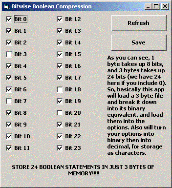



## Store 24 Booleans in just 3 bytes\!

### Description

This will store 24 boolean statements in just a 3 byte file! (3 bytes = 24 bits). I harness the power of bits here and use it to store true and false values. Please vote if u like it and leave a comment.
 
### More Info
 

             |
---                |---
**Submitted On**   |2002-02-24 19:14:46
**By**             |[Armen Shimoon](https://github.com/Planet-Source-Code/PSCIndex/blob/master/ByAuthor/armen-shimoon.md)
**Level**          |Intermediate
**User Rating**    |4.9 (39 globes from 8 users)
**Compatibility**  |VB 5\.0, VB 6\.0
**Category**       |[Files/ File Controls/ Input/ Output](https://github.com/Planet-Source-Code/PSCIndex/blob/master/ByCategory/files-file-controls-input-output__1-3.md)
**World**          |[Visual Basic](https://github.com/Planet-Source-Code/PSCIndex/blob/master/ByWorld/visual-basic.md)
**Archive File**   |[Store\_24\_B573532242002\.zip](https://github.com/Planet-Source-Code/armen-shimoon-store-24-booleans-in-just-3-bytes__1-32088/archive/master.zip)

